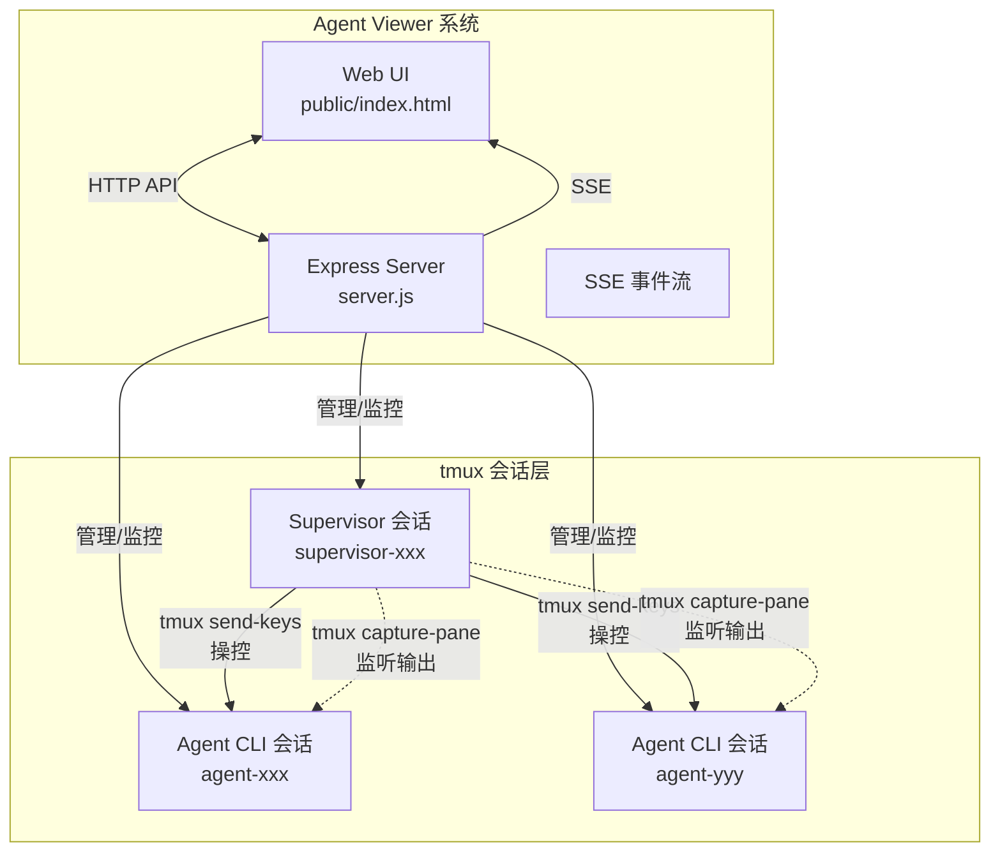
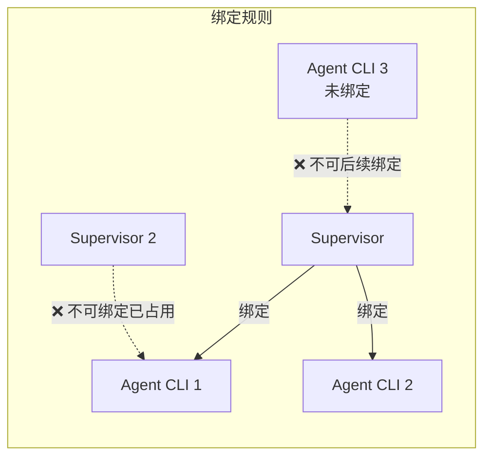
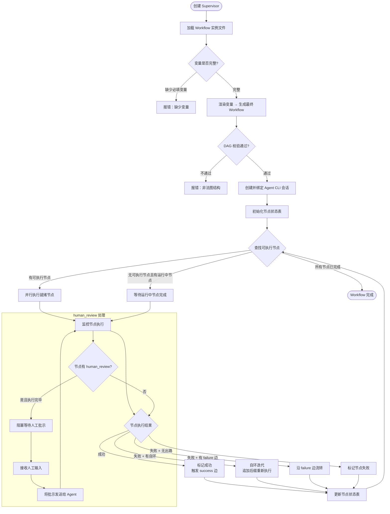
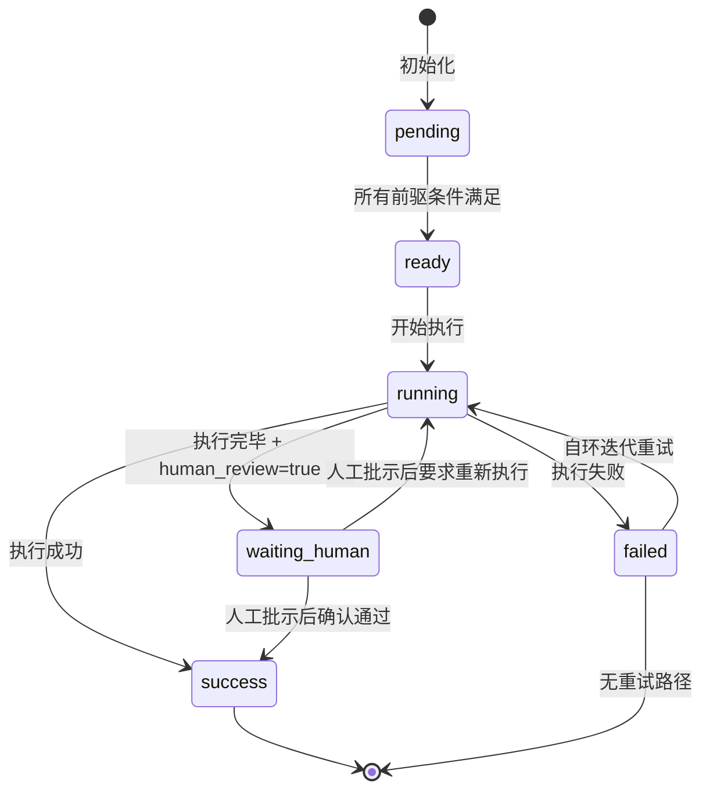
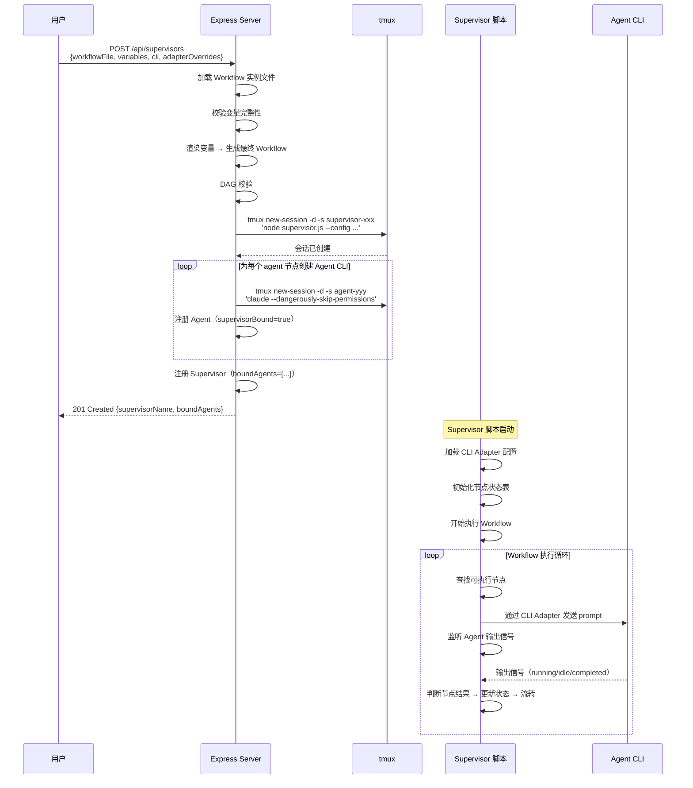
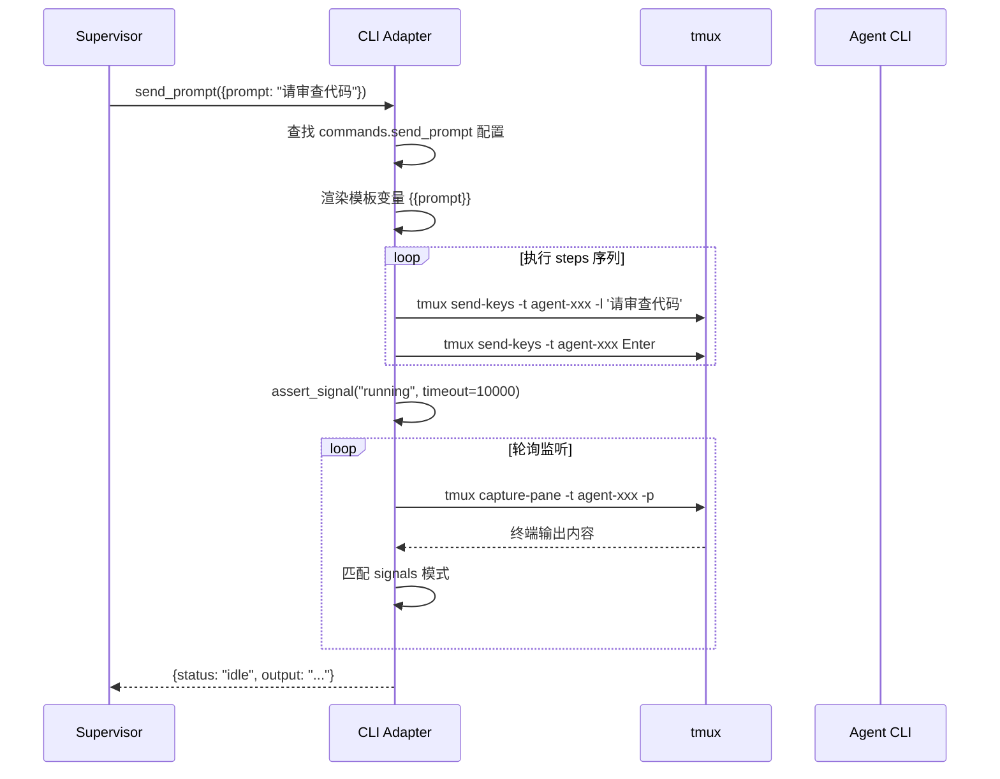
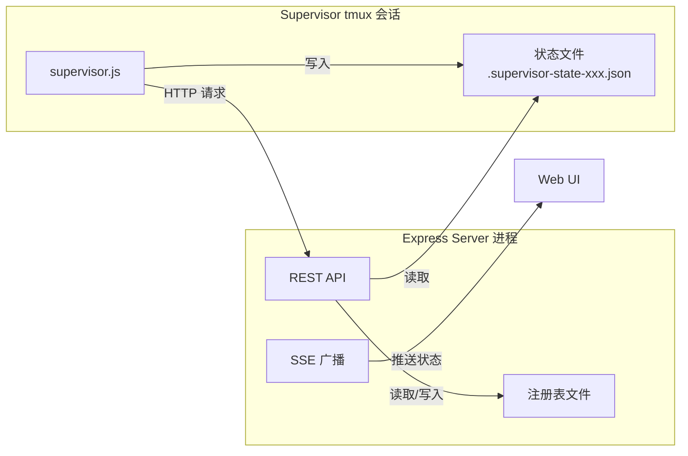

# Supervisor（督导者）设计文档

## 1. 概述

Supervisor（督导者）是 Agent Viewer 系统中的一个新角色，它本身也是一个由 tmux 管理的终端会话，运行一个交互式脚本程序。Supervisor 的核心职责是：

1. **绑定并操控** 一个或多个 Agent CLI 会话（如 Claude Code、CodeBuddy）
2. **基于 Workflow 实例文件** 自动编排和驱动多节点任务的执行
3. **响应 Agent CLI 的输出信号**，根据预定义规则做出决策（如重试、流转、人工介入等）
4. **提供高度配置化的中间层**，使不同 CLI 工具的操作指令、信号格式等可从配置文件读取

### 1.1 与现有系统的关系



## 2. 核心概念

### 2.1 Supervisor（督导者）

- **本质**：一个 tmux 会话，运行 `supervisor.sh`（或 `supervisor.js`）交互式脚本
- **会话命名**：`supervisor-{label}`，与 Agent 的 `agent-{label}` 命名空间区分
- **生命周期**：创建 → 运行（执行 Workflow）→ 完成/终止
- **状态**：`initializing`（初始化中）、`running`（执行中）、`waiting_human`（等待人工批示）、`paused`（暂停）、`completed`（已完成）、`error`（异常）

### 2.2 绑定关系

- Supervisor 与 Agent CLI 的绑定关系在 **创建时确定，不可后续变更**
- 一个 Supervisor 可以绑定多个 Agent CLI（用于 Workflow 中的并行节点）
- 一个 Agent CLI **只能被一个 Supervisor 绑定**（独占关系）
- Agent CLI 在创建时若未绑定 Supervisor，则后续不能再被任何 Supervisor 绑定
- 绑定关系记录在 Supervisor 注册表和 Agent 注册表中双向引用



### 2.3 CLI 适配中间层（CLI Adapter）

Supervisor 不直接硬编码对特定 CLI 的操作方式，而是通过一个 **CLI Adapter 中间层** 来抽象所有交互行为。这使得 Supervisor 可以适配不同的 Agent CLI 工具。

中间层定义的内容包括：

| 类别 | 说明 | 示例 |
|------|------|------|
| **指令模板** | 向 CLI 发送各类操作的 tmux 按键序列 | 发送 prompt、确认执行、取消操作 |
| **信号模式** | 从 CLI 输出中识别状态的正则表达式 | 运行中、空闲、完成、错误、等待确认 |
| **状态映射** | 将 CLI 的原始状态映射为 Supervisor 理解的标准状态 | `esc to interrupt` → `running` |
| **能力声明** | 该 CLI 支持哪些操作 | 是否支持上下文清空、步骤回退 |

## 3. CLI Adapter 配置规范

### 3.1 配置文件结构

CLI Adapter 配置文件为 JSON 格式，存放在 `config/cli-adapters/` 目录下，文件名为 `{cli_name}.adapter.json`。

```json
{
  "$schema": "cli-adapter-schema.json",
  "cli_name": "claude",
  "display_name": "Claude Code",
  "version": "1.0",

  "commands": {
    "send_prompt": {
      "description": "向 CLI 发送一段 prompt 文本",
      "steps": [
        { "action": "send_text", "value": "{{prompt}}" },
        { "action": "send_key", "value": "Enter" }
      ]
    },
    "clear_context": {
      "description": "清空 CLI 的当前上下文",
      "steps": [
        { "action": "send_key", "value": "Escape" },
        { "action": "wait", "ms": 300 },
        { "action": "send_text", "value": "/clear" },
        { "action": "send_key", "value": "Enter" }
      ]
    },
    "rollback_step": {
      "description": "回退到上一步",
      "steps": [
        { "action": "send_key", "value": "Escape" },
        { "action": "wait", "ms": 300 },
        { "action": "send_text", "value": "/undo" },
        { "action": "send_key", "value": "Enter" }
      ]
    },
    "interrupt": {
      "description": "中断当前执行",
      "steps": [
        { "action": "send_key", "value": "Escape" }
      ]
    },
    "confirm_action": {
      "description": "确认/批准 CLI 的操作请求",
      "steps": [
        { "action": "send_key", "value": "Enter" }
      ]
    },
    "reject_action": {
      "description": "拒绝 CLI 的操作请求",
      "steps": [
        { "action": "send_key", "value": "Escape" }
      ]
    }
  },

  "signals": {
    "running": {
      "description": "CLI 正在执行任务",
      "patterns": ["esc to interrupt"]
    },
    "idle": {
      "description": "CLI 空闲等待输入",
      "patterns": ["^>\\s*$", "^❯\\s*$", "what.*would.*like", "can i help"]
    },
    "completed": {
      "description": "CLI 任务已完成",
      "patterns": ["has completed"]
    },
    "error": {
      "description": "CLI 报告错误",
      "patterns": ["error:", "Error:", "failed", "FAILED"]
    },
    "waiting_permission": {
      "description": "CLI 等待权限确认",
      "patterns": ["Allow\\s+(once|always)", "approve|deny"]
    },
    "waiting_plan_approval": {
      "description": "CLI 等待计划审批",
      "patterns": ["ctrl.g to edit"]
    },
    "task_output_boundary": {
      "description": "标识任务输出的起止边界（用于提取执行输出）",
      "start_pattern": "─── Output ───",
      "end_pattern": "─── End ───"
    }
  },

  "capabilities": {
    "send_prompt": true,
    "clear_context": true,
    "rollback_step": true,
    "interrupt": true,
    "confirm_action": true,
    "reject_action": true,
    "extract_output": true
  },

  "defaults": {
    "poll_interval_ms": 1000,
    "command_timeout_ms": 5000,
    "idle_detection_delay_ms": 3000,
    "max_retry_on_error": 3
  }
}
```

### 3.2 配置加载优先级

配置值的加载遵循以下优先级（高 → 低）：

1. **创建时参数** — Supervisor 创建时通过 API/CLI 传入的覆盖值
2. **Adapter 配置文件** — `config/cli-adapters/{cli_name}.adapter.json`
3. **内置默认值** — 代码中硬编码的兜底默认值

### 3.3 指令动作类型

| 动作 | 参数 | 说明 |
|------|------|------|
| `send_text` | `value: string` | 通过 `tmux send-keys -l` 发送文本 |
| `send_key` | `value: string` | 通过 `tmux send-keys` 发送特殊按键（Enter, Escape, Up, Down 等） |
| `wait` | `ms: number` | 等待指定毫秒数 |
| `capture_output` | `lines: number` | 捕获 pane 输出（用于条件判断） |
| `assert_signal` | `signal: string, timeout_ms: number` | 等待直到检测到指定信号，超时则失败 |

## 4. Workflow 执行引擎

### 4.1 Workflow 实例文件

Supervisor 基于符合 `workflow-definition.md` 规范的 **Workflow 实例文件** 来执行任务。实例文件在标准 Workflow 定义的基础上，增加了 **变量模板** 支持。

#### 4.1.1 变量模板语法

实例文件中可以使用 `{{variable_name}}` 语法定义未写死的变量，这些变量在创建 Supervisor 时由用户填写。

```json
{
  "id": "wf_code_review",
  "name": "代码审查工作流",
  "variables": {
    "repo_url": {
      "description": "Git 仓库地址",
      "type": "string",
      "required": true
    },
    "branch": {
      "description": "目标分支",
      "type": "string",
      "default": "main"
    },
    "review_focus": {
      "description": "审查重点",
      "type": "string",
      "required": true
    }
  },
  "nodes": [
    {
      "id": "clone",
      "type": "script",
      "script": "git clone {{repo_url}} /tmp/review-repo && cd /tmp/review-repo && git checkout {{branch}}"
    },
    {
      "id": "review",
      "type": "agent",
      "prompt": "请对 /tmp/review-repo 中的代码进行审查，重点关注：{{review_focus}}",
      "human_review": true,
      "loads": [
        { "type": "node", "node_id": "clone" }
      ]
    }
  ],
  "edges": [
    { "source": "clone", "target": "review", "condition": "success" }
  ]
}
```

#### 4.1.2 变量定义 Schema

```json
{
  "variables": {
    "type": "object",
    "description": "Workflow 实例变量定义",
    "additionalProperties": {
      "type": "object",
      "required": ["description"],
      "properties": {
        "description": { "type": "string", "description": "变量说明" },
        "type": { "type": "string", "enum": ["string", "number", "boolean"], "default": "string" },
        "required": { "type": "boolean", "default": false },
        "default": { "description": "默认值，类型与 type 一致" }
      }
    }
  }
}
```

### 4.2 执行流程



### 4.3 节点执行状态机

每个节点在 Workflow 执行过程中有以下状态：



### 4.4 节点到 Agent CLI 的映射

| 节点类型 | 执行方式 |
|----------|----------|
| `agent` | Supervisor 通过 CLI Adapter 向绑定的 Agent CLI 发送 prompt，监听输出直到完成 |
| `script` | Supervisor 直接在自身 tmux 会话中（或创建临时子 shell）执行 shell 命令 |

**Agent 分配策略**：

- Supervisor 创建时会根据 Workflow 中 `agent` 类型节点的数量和并行度，预创建或按需创建 Agent CLI 会话
- 同一时刻，一个 Agent CLI 只执行一个节点任务
- 当并行 `agent` 节点数超过可用 Agent CLI 数量时，排队等待

### 4.5 loads 资源加载

Supervisor 在执行节点前，负责解析该节点的 `loads` 配置并准备资源：

| load 类型 | Supervisor 行为 |
|-----------|----------------|
| `node` | 从节点状态表中读取引用节点的执行输出，根据 `select` 决定读取最后一次还是全部迭代输出 |
| `file` | 读取本地文件内容 |
| `url` | 通过 HTTP 请求获取网络资源内容 |

加载的资源内容会被拼接到节点的 prompt 中，作为上下文一并发送给 Agent CLI。

### 4.6 执行输出与聊天记录

每个节点执行完毕后，Supervisor 需要采集两种记录：

- **聊天记录**：通过 `tmux capture-pane` 捕获 Agent CLI 的完整终端输出
- **执行输出**：通过 CLI Adapter 中定义的 `task_output_boundary` 信号模式提取最终结果；若无边界标识，则取 Agent 最后一次响应的完整内容

这些记录存储在 Supervisor 的运行时状态中，供后续节点的 `loads` 引用和 Web UI 展示。

## 5. Supervisor 注册表

### 5.1 数据结构

Supervisor 的注册信息持久化在 `.supervisor-registry.json` 中，与 Agent 注册表 `.agent-registry.json` 分离。

```json
{
  "supervisor-code-review-abc1": {
    "label": "code-review",
    "state": "running",
    "createdAt": 1700000000000,
    "completedAt": null,

    "workflowFile": "/path/to/workflow-instance.json",
    "workflowId": "wf_code_review",
    "variables": {
      "repo_url": "https://github.com/example/repo.git",
      "branch": "develop",
      "review_focus": "安全漏洞"
    },

    "boundAgents": ["agent-review-xyz1", "agent-scan-xyz2"],
    "cliAdapter": "claude",
    "adapterOverrides": {},

    "nodeStates": {
      "clone": { "status": "success", "iterations": 1, "output": "..." },
      "review": { "status": "waiting_human", "iterations": 1, "output": "..." }
    },

    "executionLog": [
      { "timestamp": 1700000001000, "event": "node_started", "nodeId": "clone" },
      { "timestamp": 1700000010000, "event": "node_completed", "nodeId": "clone", "result": "success" },
      { "timestamp": 1700000011000, "event": "node_started", "nodeId": "review" },
      { "timestamp": 1700000050000, "event": "node_waiting_human", "nodeId": "review" }
    ]
  }
}
```

### 5.2 Agent 注册表扩展

现有的 Agent 注册表需要增加绑定信息字段：

```json
{
  "agent-review-xyz1": {
    "label": "code-review-agent",
    "projectPath": "/tmp/review-repo",
    "prompt": "...",
    "cli": "claude",
    "createdAt": 1700000000000,
    "state": "running",
    "boundToSupervisor": "supervisor-code-review-abc1",
    "supervisorBound": true
  }
}
```

新增字段：
- `supervisorBound`：`boolean` — 该 Agent 是否在创建时被绑定到 Supervisor（一旦为 `false` 则永远不可被绑定）
- `boundToSupervisor`：`string | null` — 绑定的 Supervisor 会话名（仅当 `supervisorBound=true` 时有值）

## 6. Supervisor 创建流程



## 7. Supervisor 操作 Agent CLI 的能力

### 7.1 核心操作

| 操作 | 说明 | 触发场景 |
|------|------|----------|
| **发送 Prompt** | 向 Agent CLI 输入指定的 prompt 文本 | 执行 agent 节点时 |
| **清空上下文** | 清除 Agent CLI 的对话历史 | 节点切换时、重试前 |
| **回退步骤** | 撤销 Agent 的上一步操作 | 人工批示要求回退 |
| **中断执行** | 停止 Agent 当前正在进行的任务 | 超时、人工干预 |
| **确认操作** | 批准 Agent 的权限请求或计划 | 自动审批模式 |
| **拒绝操作** | 拒绝 Agent 的权限请求 | 安全策略 |

### 7.2 操作流程（以发送 Prompt 为例）



## 8. 人工批示（Human Review）机制

### 8.1 流程

当 Workflow 中某个 `agent` 节点设置了 `human_review: true` 时：

1. Agent 执行完毕后，Supervisor 检测到 Agent 进入 `idle` 状态
2. Supervisor 将该节点标记为 `waiting_human` 状态
3. Supervisor 自身也进入 `waiting_human` 状态，阻塞 Workflow 推进
4. 通过 Web UI 或 API，用户可以：
   - **查看** Agent 的执行输出和聊天记录
   - **输入批示** 文本（如修改意见、确认通过等）
   - **选择动作**：`approve`（通过）、`revise`（要求修改）、`retry`（重新执行）
5. Supervisor 接收到批示后：
   - `approve`：标记节点成功，继续 Workflow 流转
   - `revise`：将批示内容作为新 prompt 发送给 Agent，Agent 据此修正输出
   - `retry`：清空 Agent 上下文，重新执行该节点

### 8.2 批示输入方式

| 方式 | 说明 |
|------|------|
| **Web UI** | 通过 Agent Viewer 的 Web 界面提交批示（推荐） |
| **API** | `POST /api/supervisors/:name/review` 提交批示 |
| **Supervisor 终端** | 直接在 Supervisor 的 tmux 会话中输入（交互式脚本的 stdin） |

## 9. API 设计

### 9.1 Supervisor 管理 API

| 方法 | 路径 | 说明 |
|------|------|------|
| GET | `/api/supervisors` | 获取所有 Supervisor 列表及状态 |
| POST | `/api/supervisors` | 创建新 Supervisor |
| GET | `/api/supervisors/:name` | 获取指定 Supervisor 详情 |
| DELETE | `/api/supervisors/:name` | 终止 Supervisor 及其绑定的 Agent |
| DELETE | `/api/supervisors/:name/cleanup` | 从注册表中移除已完成的 Supervisor |

### 9.2 Workflow 执行 API

| 方法 | 路径 | 说明 |
|------|------|------|
| GET | `/api/supervisors/:name/workflow` | 获取 Workflow 执行状态（节点状态、执行日志） |
| GET | `/api/supervisors/:name/nodes/:nodeId/output` | 获取指定节点的执行输出 |
| GET | `/api/supervisors/:name/nodes/:nodeId/chat` | 获取指定节点的聊天记录 |
| POST | `/api/supervisors/:name/pause` | 暂停 Workflow 执行 |
| POST | `/api/supervisors/:name/resume` | 恢复 Workflow 执行 |

### 9.3 人工批示 API

| 方法 | 路径 | 说明 |
|------|------|------|
| GET | `/api/supervisors/:name/pending-reviews` | 获取等待批示的节点列表 |
| POST | `/api/supervisors/:name/review` | 提交人工批示 |

#### 创建 Supervisor 请求体

```json
{
  "workflowFile": "/path/to/workflow-instance.json",
  "variables": {
    "repo_url": "https://github.com/example/repo.git",
    "branch": "develop",
    "review_focus": "安全漏洞"
  },
  "cli": "claude",
  "adapterOverrides": {
    "defaults": {
      "poll_interval_ms": 2000
    }
  },
  "agentProjectPath": "/tmp/workspace"
}
```

#### 提交批示请求体

```json
{
  "nodeId": "review",
  "action": "revise",
  "message": "请补充对 SQL 注入风险的检查"
}
```

## 10. 文件结构规划

```
agent-viewer/
├── server.js                          # 现有 Express 服务（需扩展 Supervisor API）
├── public/
│   └── index.html                     # 现有前端（需扩展 Supervisor UI）
├── supervisor/
│   ├── supervisor.js                  # Supervisor 主脚本（tmux 中运行）
│   ├── workflow-engine.js             # Workflow 执行引擎
│   ├── cli-adapter.js                 # CLI Adapter 中间层实现
│   ├── signal-monitor.js              # 信号监听器（轮询 tmux 输出）
│   ├── variable-renderer.js           # 变量模板渲染器
│   └── human-review-handler.js        # 人工批示处理器
├── config/
│   └── cli-adapters/
│       ├── claude.adapter.json        # Claude Code 适配器配置
│       └── codebuddy.adapter.json     # CodeBuddy 适配器配置
├── docs/
│   ├── workflow-definition.md         # 现有 Workflow 定义文档
│   └── supervisor-design.md           # 本设计文档
└── .supervisor-registry.json          # Supervisor 注册表（运行时生成）
```

## 11. Supervisor 与 Server 的通信机制

Supervisor 脚本运行在独立的 tmux 会话中，需要与 Express Server 进行通信：

### 11.1 通信方式



- **Supervisor → Server**：Supervisor 脚本通过 HTTP 请求调用 Server API（如报告状态变更、请求人工批示等）
- **Server → Supervisor**：Server 通过写入共享状态文件或 tmux send-keys 向 Supervisor 传递指令（如人工批示结果）
- **状态同步**：Supervisor 将实时执行状态写入 `.supervisor-state-{name}.json` 文件，Server 轮询读取并通过 SSE 广播给 Web UI

### 11.2 状态文件结构

```json
{
  "supervisorName": "supervisor-code-review-abc1",
  "state": "running",
  "currentNodes": ["review"],
  "nodeStates": {
    "clone": { "status": "success", "iterations": 1 },
    "review": { "status": "running", "iterations": 1 }
  },
  "pendingReviews": [],
  "lastUpdated": 1700000050000
}
```

## 12. 异常处理

| 异常场景 | 处理策略 |
|----------|----------|
| Agent CLI 会话意外终止 | Supervisor 检测到会话丢失，标记节点失败，尝试沿 failure 边流转 |
| Supervisor 会话意外终止 | Server 检测到 Supervisor 会话丢失，标记为 error 状态；支持从状态文件恢复重启 |
| 节点执行超时 | Supervisor 根据配置的超时时间中断 Agent，标记节点失败 |
| Workflow 实例文件格式错误 | 创建时校验，拒绝创建并返回详细错误信息 |
| 变量缺失 | 创建时校验必填变量，缺失则拒绝创建 |
| 网络资源（url 类型 load）不可达 | 重试 N 次后标记节点失败 |
| 自环迭代次数过多 | 可配置最大迭代次数（默认 10），超过后强制标记失败 |

## 13. 设计约束与边界

1. **Supervisor 不修改现有 Agent 的核心逻辑** — 现有的 Agent 创建、状态检测、SSE 广播等机制保持不变，Supervisor 是一个增量功能
2. **Supervisor 脚本是独立进程** — 运行在自己的 tmux 会话中，通过文件和 HTTP 与 Server 通信，崩溃不影响 Server
3. **CLI Adapter 是纯配置驱动** — 新增 CLI 工具只需添加 adapter 配置文件，无需修改 Supervisor 代码
4. **Workflow 实例文件是静态定义** — 执行过程中不修改实例文件，运行时状态存储在状态文件中
5. **绑定关系不可变** — 创建时确定，运行期间不可解绑或重新绑定
