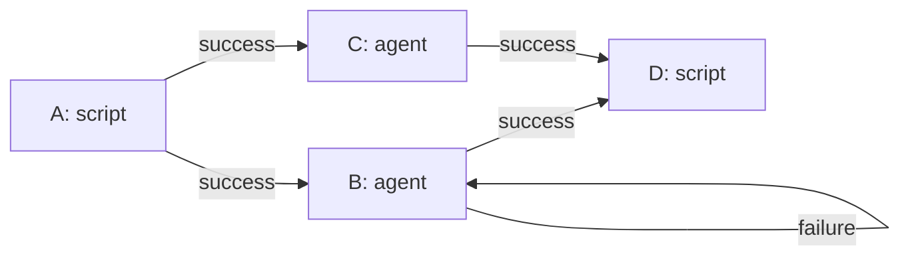

# Workflow 有向图定义

## 1. 概述

Workflow 是一个有向图，由**节点（Node）**和**边（Edge）**组成：

- 节点是一个任务，有唯一编号，类型为 `agent` 或 `script`
- 边控制执行顺序，每条边带条件：`success` 或 `failure`
- 仅允许自环（迭代语义），禁止非自环环路
- 自环迭代时，编号追加后缀：`node_1` → `node_1#1` → `node_1#2`
- 每个节点执行完毕后产生两种记录：**聊天记录**（执行过程）和**执行输出**（最终结果）
- 节点通过 `loads` 加载外部资源，支持三种类型：`node`（其他节点的执行输出）、`file`（本地文件）、`url`（网络资源）
- agent 节点可通过 `human_review` 字段标明执行完毕后是否需要阻塞等待人类批示输入
- 无依赖关系的节点可并行执行

## 2. JSON Schema

```json
{
  "$schema": "http://json-schema.org/draft-07/schema#",
  "title": "Workflow",
  "description": "简易有向图工作流定义",
  "type": "object",
  "required": ["id", "name", "nodes", "edges"],
  "properties": {
    "id": {
      "type": "string",
      "description": "工作流唯一标识"
    },
    "name": {
      "type": "string",
      "description": "工作流名称"
    },
    "nodes": {
      "type": "array",
      "description": "节点列表",
      "minItems": 1,
      "items": { "$ref": "#/definitions/node" }
    },
    "edges": {
      "type": "array",
      "description": "边列表",
      "items": { "$ref": "#/definitions/edge" }
    }
  },
  "definitions": {
    "node": {
      "type": "object",
      "required": ["id", "type"],
      "properties": {
        "id": {
          "type": "string",
          "description": "节点唯一编号"
        },
        "type": {
          "type": "string",
          "enum": ["agent", "script"],
          "description": "节点类型：agent 任务 或 script 任务"
        },
        "prompt": {
          "type": "string",
          "description": "agent 任务的提示词（仅 type=agent 时必填）"
        },
        "script": {
          "type": "string",
          "description": "script 任务要执行的 shell 代码（仅 type=script 时必填）"
        },
        "loads": {
          "type": "array",
          "items": { "$ref": "#/definitions/load_item" },
          "description": "加载外部资源的列表，支持节点输出、本地文件、网络资源三种类型"
        },
        "human_review": {
          "type": "boolean",
          "default": false,
          "description": "执行完毕后是否阻塞等待人类批示输入（仅 type=agent 时有效）。为 true 时，agent 执行完毕后会阻塞等待人类输入批示，批示内容将作为该节点的附加输入，节点据此决定后续行为；为 false 时正常流转，不等待"
        }
      },
      "allOf": [
        {
          "if": { "properties": { "type": { "const": "agent" } } },
          "then": { "required": ["prompt"] }
        },
        {
          "if": { "properties": { "type": { "const": "script" } } },
          "then": { "required": ["script"] }
        }
      ]
    },
    "load_item": {
      "type": "object",
      "required": ["type"],
      "description": "加载资源项",
      "allOf": [
        {
          "if": { "properties": { "type": { "const": "node" } } },
          "then": { "required": ["node_id"] }
        },
        {
          "if": { "properties": { "type": { "const": "file" } } },
          "then": { "required": ["path"] }
        },
        {
          "if": { "properties": { "type": { "const": "url" } } },
          "then": { "required": ["url"] }
        }
      ],
      "properties": {
        "type": {
          "type": "string",
          "enum": ["node", "file", "url"],
          "description": "资源类型：node（节点输出）、file（本地文件）、url（网络资源）"
        },
        "node_id": {
          "type": "string",
          "description": "引用的节点编号（仅 type=node 时必填），不可引用自身"
        },
        "select": {
          "type": "string",
          "enum": ["all", "last"],
          "default": "last",
          "description": "节点输出选取方式（仅 type=node 时有效）：all 读取所有迭代输出，last 仅读取最后一次迭代输出，默认 last"
        },
        "path": {
          "type": "string",
          "description": "本地文件路径（仅 type=file 时必填）"
        },
        "url": {
          "type": "string",
          "format": "uri",
          "description": "网络资源地址（仅 type=url 时必填）"
        }
      }
    },
    "edge": {
      "type": "object",
      "required": ["source", "target", "condition"],
      "properties": {
        "source": {
          "type": "string",
          "description": "源节点编号"
        },
        "target": {
          "type": "string",
          "description": "目标节点编号"
        },
        "condition": {
          "type": "string",
          "enum": ["success", "failure"],
          "description": "触发条件"
        }
      }
    }
  }
}
```

## 3. 规则

1. **节点编号唯一**：`nodes` 中每个 `id` 不可重复
2. **边引用合法**：`source` 和 `target` 必须是已定义的节点 `id`
3. **仅允许自环**：`source === target` 为自环（合法）；去除自环后的图必须是 DAG（无环）
4. **自环迭代后缀**：自环执行时编号依次为 `{id}`, `{id}#1`, `{id}#2`, ...
5. **并行执行**：无入边依赖的节点可同时执行；一个节点的所有前驱条件满足后即可执行
6. **节点执行记录**：每个节点执行完毕后会产生两种记录：
   - **聊天记录** — 节点执行过程中的完整对话/日志记录
   - **执行输出** — 节点执行的最终结果
7. **loads 类型**：`loads` 数组中每个元素通过 `type` 区分资源类型：
   - `node` — 读取其他节点的**执行输出**（而非聊天记录），`node_id` 必须引用同 workflow 中其他节点的 `id`，不可引用自身
   - `file` — 读取本地文件内容，`path` 为文件路径
   - `url` — 读取网络资源内容，`url` 为资源地址
8. **node 类型的 select 语义**：当 `type=node` 时，通过 `select` 字段指定读取方式：
   - `"last"`（默认）— 读取该节点最后一次迭代的执行输出
   - `"all"` — 读取该节点所有迭代的执行输出（数组形式）
9. **人类批示输入**：agent 节点可通过 `human_review` 字段（布尔值，默认 `false`）标明执行完毕后是否需要阻塞等待人类批示输入。当 `human_review` 为 `true` 时，agent 执行完毕后会阻塞等待人类输入批示，批示内容将作为该节点的附加输入，节点据此决定后续行为（如修正输出、重新执行等）；当 `human_review` 为 `false` 时，节点执行完毕后正常流转，不等待

## 4. 示例

```json
{
  "id": "wf_001",
  "name": "示例工作流",
  "nodes": [
    {
      "id": "A", "type": "script",
      "script": "git clone https://github.com/example/repo.git /tmp/repo"
    },
    {
      "id": "B", "type": "agent",
      "prompt": "请对代码进行审查",
      "human_review": true,
      "loads": [
        { "type": "node", "node_id": "A" },
        { "type": "file", "path": "/tmp/repo/.eslintrc.json" }
      ]
    },
    {
      "id": "C", "type": "agent",
      "prompt": "请根据安全规范进行扫描",
      "loads": [
        { "type": "node", "node_id": "A" },
        { "type": "url", "url": "https://example.com/security-rules.json" }
      ]
    },
    {
      "id": "D", "type": "script",
      "script": "echo '所有任务完成'",
      "loads": [
        { "type": "node", "node_id": "B", "select": "all" },
        { "type": "node", "node_id": "C", "select": "last" }
      ]
    }
  ],
  "edges": [
    { "source": "A", "target": "B", "condition": "success" },
    { "source": "A", "target": "C", "condition": "success" },
    { "source": "B", "target": "B", "condition": "failure" },
    { "source": "B", "target": "D", "condition": "success" },
    { "source": "C", "target": "D", "condition": "success" }
  ]
}
```



执行顺序：
1. `A` 执行成功
2. `B` 和 `C` **并行**执行
3. `B` 若失败，自环迭代（`B#1`, `B#2`...）
4. `B` 和 `C` 都成功后，`D` 执行
